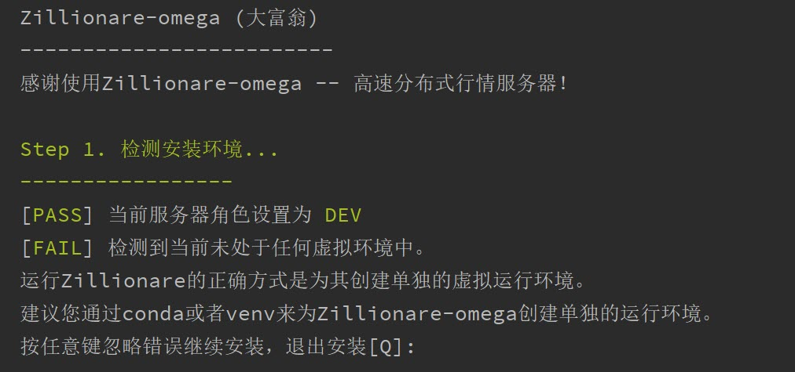
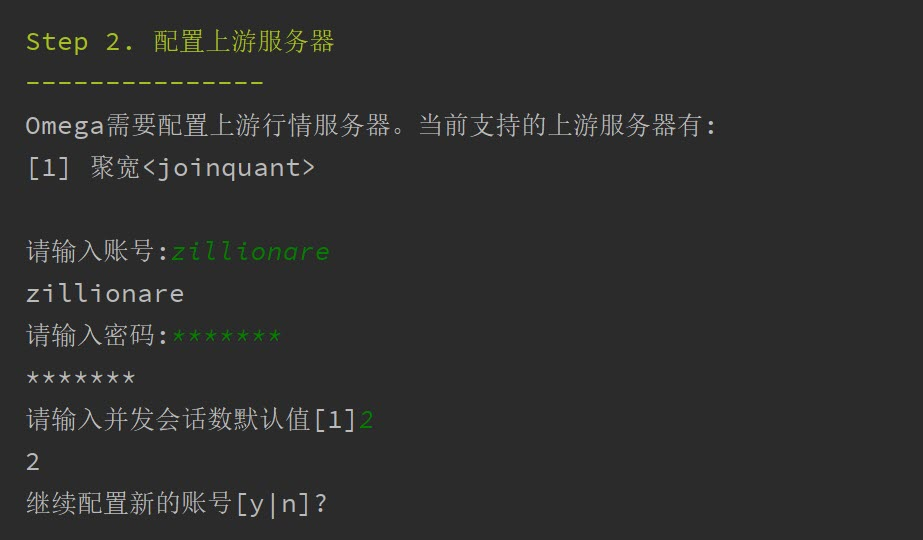
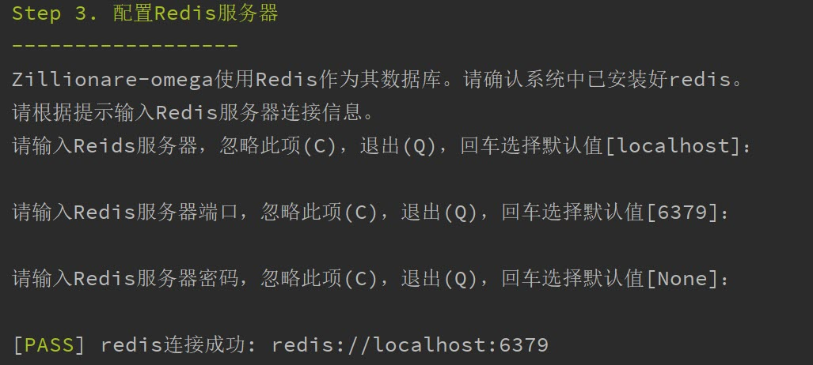
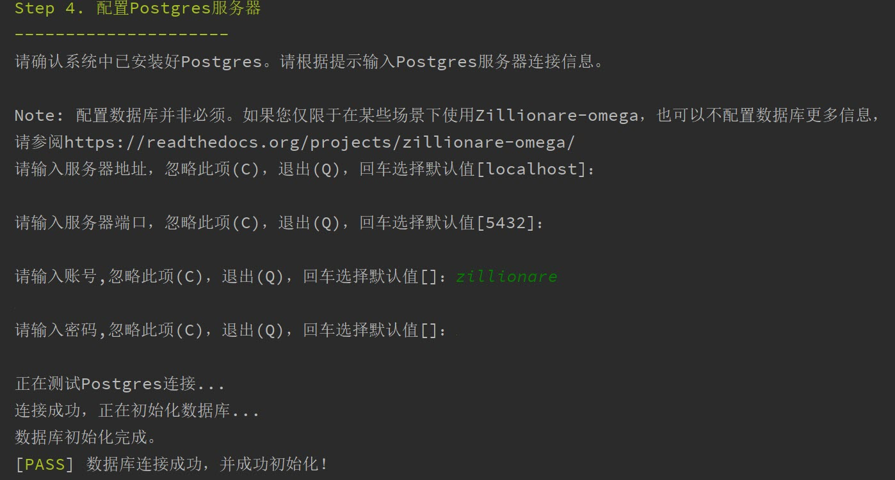
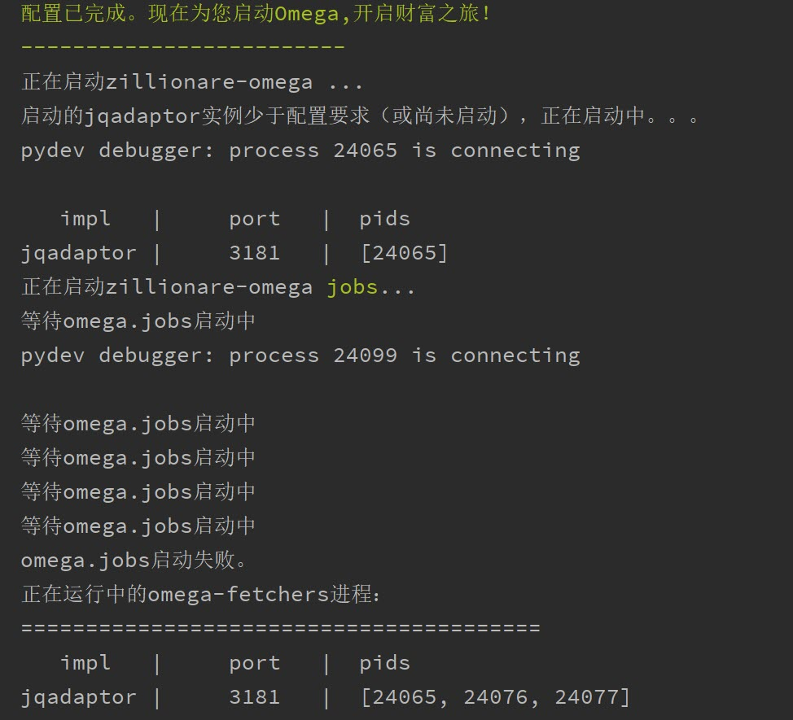

# 1. 系统要求


## 1.1. 硬件清单

### 1.1.1. 内存


Zillionare-Omega(以下简称Omega)将行情数据保存在内存数据库中(redis-server)。根据实测结果，每存储1000条A股全市场日线数据（只包括股票数据，按5000支计），大概需要0.75GB的内存。这相当于存储了4年多的A股全市场数据。

以下是推算的物理内存需求表：

| 行情数据  | 记录数（每品种） | 时长（年） | 物理内存（GB) |
| ----- | -------- | ----- | -------- |
| 日线    | 1000     | 4     | 0.75     |
| 月线    | 120      | 10    | 0.09     |
| 年线    | 10       | 10    | 0.0075   |
| 小时线   | 1000     | 1     | 0.75     |
| 30分钟线 | 1000     | 0.5   | 0.75     |
| 15分钟线 | 1000     | 0.25  | 0.75     |
| 5分钟线  | 960      | 0.08  | 0.72     |
| 1分钟线  | 960      | 0.016 | 0.72     |
| 合计    |          |       | 3.7875   |


对于绝大多数动量策略的研究而言，每支品种有1000条记录用于机器学习基本上是足够的。更多的行情数据，可能也一些pattern的自重复而已。当然Omega也允许您根据自己的需求和硬件环境，来选择保存哪些证券品种，以及每个证券品种保存多长的数据（包括周期）。

如果您的学习模型需要结合基本面（财务数据），从而可能需要相应更长周期的行情数据。在这种情况下，建议您只保存日线及以上级别的数据。公司基本面的数据，对日线以下级别的股价波动是没有影响的。保存全市场10年的日线数据，也只要2GB左右的内存。

Omega社区版被设计为支持从个人到小型团队的AI量化研究。如果您需要保存tick级的数据，或者较长时间范围的分钟级别数据，请使用企业版。

###CPU

Omega被设计为能运行在从台式机到多台服务器集群上。由于Python本身的限制，Python程序一般无法有效地使用机器的多个CPU（内核）。为了避免这一限制，Omega设计成异步**多进程**协作模式，从而可以最大限度地利用您机器的CPU。因此，在您配置机器时，CPU仍然是越多越好。

###硬盘


Omega对硬盘的性能和容量几乎没有要求。一般而言，在安装Omega之前，系统最好至少还有50GB磁盘空间。

### 1.1.2. 网络

如果您使用分布式部署，建议Zillionare各服务都运行在同一个千兆局域网内。

## 1.2. 软件清单

???+ note

    Omega不适合部署在Windows操作系统上。Omega的各个版本均只在Ubuntu 18， Ubuntu 20上进行测试。因此，即使Omega能在Windows上运行起来，我们也不推荐您这样使用。

    如果您是个人研究使用，只有Windows机器，建议您启用Windows的WSL平台，这样就可以在同一台机器上，同时使用Ubuntu和Windows了。关于如何在Windows上启用WSL，您可以参考这篇文章[开发环境和IDE](http://www.jieyu.ai/blog/best_practice_python/chap1/)

Omega使用Python 3.8开发，理论上可以部署在任何类Unix的机器上。但只在Ubuntu上经过严格的测试。以下为软件环境类清单：

| 软件类别  | 软件        | 版本    | 说明 |
| ----- | --------- | ----- | -- |
| 操作系统  | Ubuntu    | 18/20 |    |
| 运行时   | Python    | >=3.8   |    |
| 内存数据库 | Redis     | >=4.0  |    |
| 数据库   | Postgres  | >=10   | 选装 |
| 负载均衡  | Nginx     |       | 选装 |
| 行情服务  | jqdatasdk | >=1.8  |    |
| 编译工具 | gcc | latest | jqdatasdk使用了thrift2，需要gcc进行编译|

如果您的模型中不打算使用财务数据，则可以不安装Postgres。但是，即使是在动量策略研究中，您也可能使用财务数据。因为流通股本属于财务数据，所以在换手率的计算中，还必须使用财务数据。即便如此，如果您对性能没有太高要求的话，仍然可以不安装Postgres数据库。当您需要使用这些财务数据时，Omega会从上游数据服务器获取相关数据用于计算（但这些数据不会在本地保存）。在这种情况下，计算性能的强弱，可能主要取决于上游行情服务器的数据服务能力和响应速度。

尽管Omega被设计成支持分布式部署（即可以运行在多台机器上，并且相互协作），但自己只实现了简单的任务管理。负载均衡的实现，目前是由Nginx这样的代理在HTTP层完成的。您可以根据需要来选择是否这样进行部署。

# 2. 推荐的部署模式

Omega的部署全景图如下，您可以根据自己的需要进行定制。


## 2.1. 个人研究

对于个人研究，我们推荐可以在单台笔记本、台式机上进行部署。您可以将Omega, redis和Postgres安装在同一台机器上。如果您只做动量研究，也可以不安装Postgres。

如果您的操作系统是Windows的话，建议您按照 [开发环境和IDE](http://www.jieyu.ai/blog/best_practice_python/chap1/) 来安装WSL，以获得Omega安装需要的Ubuntu操作系统环境。

如果您使用Mac机器的话，应该可以直接安装Omega。


## 2.2. 团队使用

如果您有一个团队需要使用Omega提供的行情服务，非常棒！Omega完全适合这种场景下的应用。建议您根据团队使用数据的频度、量级和人数，来决定需要多少台机器安装Omega，以及安装Nginx作为Omega的前置代理。

# 3. 安装步骤


## 3.1. 创建Python虚拟环境


为避免与其它Python程序产生冲突，推荐您为Omega创建专属的运行环境。您可以使用[conda](https://docs.conda.io/en/latest/miniconda.html) 或者venv来创建专属运行环境。这里以conda为例：

1. 从 [这里](https://docs.conda.io/en/latest/miniconda.html)下载miniconda到本地，并运行安装。下载页面提供了多个版本，请下载Python3.8的Linux installer版本（假定您使用Ubuntu。如果使用windows，请参考 [这篇文章](http://blog.jieyu.ai/blog_2020/%E5%A6%82%E4%BD%95%E6%9E%84%E5%BB%BAPython%E5%BC%80%E5%8F%91%E7%8E%AF%E5%A2%83/) 在Windows上启用WSL和Ubuntu。

2. 运行下面的命令以创建Omega运行环境:

```
conda create -n omega python=3.8
conda activate omega
```

## 3.2. 设置服务器角色

Omega使用cfg4py来解析和管理配置。作为最佳实践，cfg4py要求您设置服务器角色，以便为您加载正确的配置。在开始安装之前，您需要通过环境变量来设置服务器角色。

您可以在/etc/profile，或者~/.bashrc中加上这样一行：

```bash

    # 可选项包括 PRODUCTION, TEST, DEV
    export __cfg4py_server_role__ = PRODUCTION
```

如果您只是普通用户，那么一般来说，应该设置为PRODUCTION。

## 3.3. 安装第三方软件

请参照Redis和Postgres的安装指南，分别完成Redis和Postgres的安装。

???+ Note

    如果您的机器上已经有其它程序在使用Redis服务，为避免冲突，请在本机上启动第二个Redis实例，
    独立为Omega提供服务。这个实例应该使用不同的端口。

    您可以为Omega安装一个全新的Postgres数据库服务器，也重复使用现有的Postgres数据库服务器，
    只要为Omega准备一个单独的数据库即可。Omega将在该数据库中创建一系列表（table)。

安装完成Postgres后，请为Zillionare创建数据库，推荐使用zillionare作为数据库名称：

```bash
    # 使用psql，本地以postgres账户登录进来
    sudo su - Postgres
    psql

    # 进入数据库以后
    create user zillionare with password 'your_secret';
    create database zillionare;
    grant all privileges on database 'zillionare' to zillionare;
```

记下这里使用的用户名和口令，在安装Omega时需要使用。

## 3.4. 安装Omega


### 3.4.1. 从pip安装Omega


请运行以下命令来从pip安装zillionare-omega(以下称为Omega):

```bash

    $ pip install zillionare-omega
```


### 3.4.2. 从源代码安装Omega

Omega的源代码可以从 [github](https://github.com/zillionare/omega)下载：

你可以clone代码库：

```
    $ git clone git://github.com/zillionare/omega
```

或者下载 [源码包](https://github.com/zillionare/omega/tarball/master):

```
    $ curl -OJL https://github.com/zillionare/omega/tarball/master
```
一旦源代码复制到本地，可以执行以下命令进行安装：

```
    $ python setup.py install
```

除非您是Omega的协同开发者，或者遇到紧急修复的bug，否则都应该通过``pip``的方式来安装稳定版，而不应该从源代码安装。

## 3.5. 初始化


由于pip执行安装的过程中，无法与用户进行交互（这是wheel格式包的缺陷），所以初始化的任务，我们通过`omega setup`命令来完成：

初始化主要完成以下任务：

1. 检测安装环境。
2. 配置行情服务器
3. 配置Redis数据库
4. 配置Postgres数据库
5. 其它设置（如日志等）
6. 导入历史K线数据

### 3.5.1. 初始化前的检查


现在，请确认您已经准备好：

1. 设置好了服务器角色
2. 已切换至专门为Omega创建的虚拟运行环境
3. Redis服务、Postgres服务已安装好，并且都已经启动。
4. zillionare数据库已经创建，并且已得到数据库账户。
5. 已安装了Omega

现在，您就可以开始进入到启动Omega前的最后一步了。请使用以下命令来进行初始化：
```
    omega setup
```
### 3.5.2. 检测安装环境

作为一种最佳实践，Omega推荐您为Omega创建专属虚拟运行环境，并始终在该虚拟环境中运行Omega。安装程序也会检测当前是否在虚拟环境中运行。

Omega使用 cfg4py_ 来管理配置。Cfg4py要求您为部署机器设置场景（开发、测试、生产环境），以便根据对应的场景来应用配置。因此，在Omega安装时，也会检测当前机器是否正确地设置了场景。



### 3.5.3. 配置行情服务器

Omega通过插件来从上游服务器获取行情数据。当前支持的数据提供源是聚宽(JoinQuant)。

在使用聚宽之前，您需要在[聚宽官网]上申请 `jqdatasdk` 的使用权限。在安装过程中，将需要您提供这些信息。每个聚宽账号最多允许3个并发连接。在安装时，Omega需要您为每个账号决定同时允许的最大会话（连接）数。



Omega支持多个数据源同时工作（但当前只提供了对聚宽的接口适配），并且支持在同一数据源下，配置多个账号，多个会话（如果您这样做，请确保得到了服务提供商的许可），从而可以快速获取实时行情。所以在上面的安装过程中，将提示您输入并发会话数，以及是否配置多个账号。

???+ tip
    Omega通过HTTP微服务向Zillionare的其它组件提供行情数据，因此Omega本身也是一种行情服务器。默认地，Omega的服务端口从3181开始，如果您有多个数据源，或者多个账号，那么Omega将为不同的数据源、或者同一数据源的不同账号，启用新的端口。

    比如，如果您拥有两个jqdatasdk的账号，并配置在Omega中使用，那么，Omega将启动两个HTTP服务器，一个监听在3181端口，另一个监听在3182端口。


安装程序没有提供端口定制的功能。但是，您可以在配置文件中找到它们并进行修改：

```yaml
    omega:
        urls:
            quotes_server: http://localhost:3181
   quotes_fetchers:
    - impl: jqadaptor    # there must be a create_instance method in this module
        workers:
        - account: ${jq_account}
            password: ${jq_password}
            port: 3181
            sessions: 2
```

这里有几点需要注意：

1. Omega使用Sanic作为HTTP服务器。由于Sanic的原因，如果您需要Omega与上游服务器同时建立3个并发会话，那么会话设置应该设置为2，而不是3，即您得到的会话数，总会比设置值大1。
2. 在上面的配置示例中，出现了${jq_account}这样的宏，这是 [cfg4py] 支持的功能，如果您设置了同名的环境变量，则 [cfg4py] 将会将其替换成为环境变量确定的值。建议Omega的协作开发者始终使用这一语法，以避免误将账号和口令公开的互联网上。
3. Omega作为本地行情服务器，其它组件在访问它时，需要得到服务地址。安装程序没有提供配置项，默认地，它被配置在 http://localhost:3181 上，这个配置是供独立研究者使用的，但无法使用多账号、多数据源功能，也没有负载均衡功能。为实现负载均衡，您需要自行安装nginx做代理，并将nginx的代理地址配置在下面的配置当中：

```
    omega:
        urls:
            quotes_fetchers: http://your_nginx_address
```

这些配置看上去比较复杂，但实际上，在您一开始的时候，可以完全按默认设置来使用。您甚至可以直接跳过这一步--如果您通过环境变量配置了聚宽的账号和密码的话。

### 3.5.4. 配置Redis服务器

行情数据都存放在Redis数据库里。您需要事先安装好Redis服务器，并告诉Omega如何连接：



### 3.5.5. 配置Postgres数据库


如果您急于开始使用Omega,您可以略过Postgres的安装和配置。但是配置数据库将使得您访问财务数据时，能获得更好的性能。因为如果您没有配置Postgres数据库的话，这些数据都将从上游服务器去实时获取。



### 3.5.6. 导入历史行情数据

我们提供了从2015年以来30分钟及以上级别的A股历史行情数据（不含指数），并且在每个月结束后更新上一个月的数据。您可以根据提示选择导入这些数据。

安装向导将提示您输入导入多少个月的数据。数据是从服务器上最新的数据，按月往前计算的。如果当前是2021年3月，则服务器上存在2015年1月到2021年2月的全部数据。如果您选择导入2个月的数据，则将为您导入从2021年1月到2021年2月的所有数据。其它数据，您将通过正常的同步来获得。

最后，安装全部结束，Omega将为您启动服务，并显示服务状态：



[聚宽官网]: https://www.joinquant.com
[cfg4py]: https://cfg4py.readthedocs.io/en/latest/
